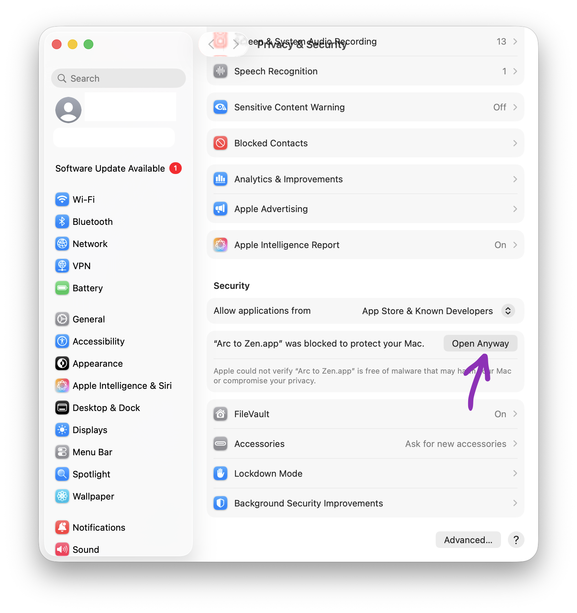

# Arc to Zen


Migrate all Arc workspaces data into Zen.

## Download

Download the latest desktop app from
[GitHub Releases](https://github.com/Thinkscape/arc-to-zen/releases/latest).

Pick the archive for your OS:

- macOS Apple Silicon: `macos-arm64`
- macOS Intel: `macos-x64`
- Windows: `windows-x64`
- Linux: `linux-x64`

## Migrates

- 🧭 Arc spaces to Zen workspaces
- 📌 pinned tabs and Essentials
- 🕘 temporary open tabs
- 🗂️ nested pinned folders
- 👁️ pinned-folder open/closed state
- 🎨 workspace icons and colors/themes
- 🌐 cached favicons

## GUI

1. Close Arc and Zen.
2. Open the downloaded app.
3. Choose the Arc data folder and target Zen profile.
4. Choose what to migrate.
5. Use **Options** to skip the synthetic `Orphaned` workspace, create backups,
   and let the app close Zen automatically.
6. Optionally enable **Clear out Zen profile before migration** to rebuild Zen
   from Arc.
7. Start the migration and wait for the progress log to finish.
8. Open Zen.

## macOS Unsigned App

The macOS build is not signed yet, so Gatekeeper may block it the first time.



1. Unzip the macOS download.
2. Try to open `Arc to Zen.app` once.
3. When macOS blocks it, open **System Settings**.
4. Go to **Privacy & Security**.
5. Scroll to **Security** and click **Open Anyway** next to `Arc to Zen.app`.
6. Confirm with **Open Anyway** and enter your password or use Touch ID if asked.
7. Open `Arc to Zen.app` again.

## CLI

Install Python dependencies:

```bash
python3 -m venv .venv
. .venv/bin/activate
pip install -e .
```

Run the full migration:

```bash
python cli.py
```

Clean rebuild mode:

```bash
python cli.py --nuke
```

`--nuke` clears existing Zen tabs, folders, pins, groups, closed-tab state, and
regular bookmarks before importing Arc data. Backups are created unless
`--no-backups` is used.

Useful switches:

- `--arc-profile PATH`
- `--zen-profile PATH`
- `--include-orphaned`
- `--no-backups`
- `--no-favicons`
- `--no-folder-states`
- `--no-workspace-icons`
- `--no-workspace-themes`
- `--nuke-only`

## Profiles

The GUI auto-detects common Arc and Zen profile locations. You can also browse
to them manually.

Common roots:

- Arc macOS: `~/Library/Application Support/Arc`
- Arc Windows: `%LOCALAPPDATA%\Packages\TheBrowserCompany.Arc_*\LocalCache\Local\Arc`
- Zen macOS: `~/Library/Application Support/zen`
- Zen Windows: `%APPDATA%\zen`
- Zen Linux: `~/.zen` or the Zen Flatpak profile directory

Zen profile resolution uses explicit selection first, then `ZEN_PROFILE_PATH`,
`ZEN_PROFILE_NAME`, Zen defaults from `installs.ini` / `profiles.ini`, and
finally the first profile containing `zen-sessions.jsonlz4`.

Arc desktop Linux is not auto-detected because Arc desktop is currently known
for macOS and Windows only.

## Build

Build a native package for the current OS:

```bash
pip install -e ".[build]"
python scripts/build_desktop.py --version dev
```

Release builds are created by GitHub Actions when a `v*` tag is pushed.
