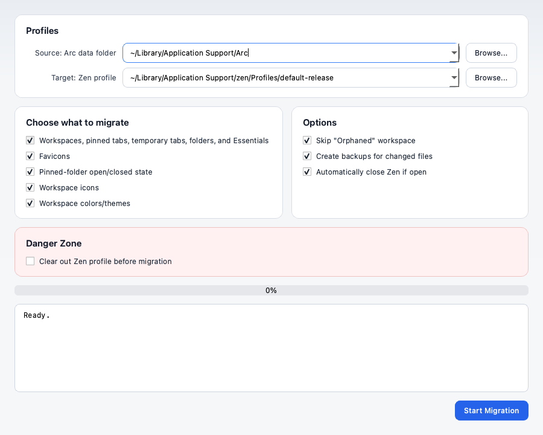

# Arc to Zen



Move Arc Browser sidebar data into Zen Browser.

## Download

Download the latest desktop app from
[GitHub Releases](https://github.com/Thinkscape/arc-to-zen/releases/latest).

Pick the archive for your OS:

- macOS Apple Silicon: `macos-arm64`
- macOS Intel: `macos-x64`
- Windows: `windows-x64`
- Linux: `linux-x64`

## Migrates

- 🧭 Arc spaces to Zen workspaces
- 📌 pinned tabs and Essentials
- 🕘 temporary open tabs
- 🗂️ nested pinned folders
- 👁️ pinned-folder open/closed state
- 🎨 workspace icons and colors/themes
- 🌐 cached favicons

## GUI

1. Close Arc and Zen.
2. Open the downloaded app.
3. Choose the Arc data folder and target Zen profile.
4. Choose what to migrate.
5. Optionally enable **Clear out Zen profile before migration** to rebuild Zen
   from Arc. Backups are written next to changed Zen files.
6. Start the migration and wait for the progress log to finish.
7. Open Zen.

On macOS, unzip the download and open `Arc to Zen.app`. If Gatekeeper blocks an
unsigned build, right-click the app and choose **Open**.

## CLI

Install Python dependencies:

```bash
python3 -m venv .venv
. .venv/bin/activate
pip install -e .
```

Run the full migration:

```bash
python cli.py
```

Clean rebuild mode:

```bash
python cli.py --nuke
```

`--nuke` clears existing Zen tabs, folders, pins, groups, closed-tab state, and
regular bookmarks before importing Arc data. It creates backups first.

Useful switches:

- `--arc-profile PATH`
- `--zen-profile PATH`
- `--no-favicons`
- `--no-folder-states`
- `--no-workspace-icons`
- `--no-workspace-themes`
- `--nuke-only`

## Profiles

The GUI auto-detects common Arc and Zen profile locations. You can also browse
to them manually.

Common roots:

- Arc macOS: `~/Library/Application Support/Arc`
- Arc Windows: `%LOCALAPPDATA%\Packages\TheBrowserCompany.Arc_*\LocalCache\Local\Arc`
- Zen macOS: `~/Library/Application Support/zen`
- Zen Windows: `%APPDATA%\zen`
- Zen Linux: `~/.zen` or the Zen Flatpak profile directory

Zen profile resolution uses explicit selection first, then `ZEN_PROFILE_PATH`,
`ZEN_PROFILE_NAME`, Zen defaults from `installs.ini` / `profiles.ini`, and
finally the first profile containing `zen-sessions.jsonlz4`.

Arc desktop Linux is not auto-detected because Arc desktop is currently known
for macOS and Windows only.

## Build

Build a native package for the current OS:

```bash
pip install -e ".[build]"
python scripts/build_desktop.py --version dev
```

Release builds are created by GitHub Actions when a `v*` tag is pushed.
